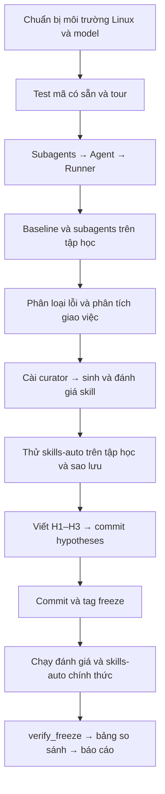

# Workflow thực hiện lab Self-Evolving Agentic

Nguồn: README.md, GUIDE.md, RUBRIC.md, REPORT_TEMPLATE.md và guides/pseudocode/01–05.
Đây là kế hoạch thực hiện; các checkpoint chưa được đánh dấu hoàn thành.
Các hàm TODO đã triển khai và kiểm tra trên Linux. Cấu hình hiện tại dùng Ollama local; các lần Gemini lỗi quota được lưu riêng, không trộn vào kết quả thí nghiệm.

## 1. Luồng thực hiện và nguyên tắc



- Chỉ triển khai TODO trong `subagents.py`, `agent.py`, `runner.py`, `curator.py`.
- Không sửa tests/, tasks/, scripts/, mã PROVIDED, hằng prompt, render_trace hoặc main của runner.
- Giữ một model, temperature và recursion-limit cho các điều kiện so sánh. Cấu hình hiện tại: `ollama:qwen3-lab-fast:8b`, temperature=0.7 và recursion-limit=60. `Modelfile.lab` đặt context 16384, giới hạn đầu ra 4096, top_p=0.8 và top_k=20.
- Dùng think=false qua adapter nội bộ và budget 180 giây/task trên Linux. Runner cách ly worker để chặn cả subagent có bound recursion_limit=9999 của thư viện. Các lượt fast đã hoàn tất trước khi thêm guard đều dưới 180 giây; lượt nested data chưa hoàn tất được lưu là gián đoạn rồi chạy lại có guard. Ghi rõ giới hạn và lịch sử này trong báo cáo.
- Chỉ phân tích dữ liệu học trước freeze; không đọc check.py, kết quả hoặc đáp án của tác vụ đánh giá để thiết kế skill.
- Curator tự sinh skill; không sửa tay nội dung. Được xóa skill kém và chạy lại curator tối đa hai lần, ghi rõ lý do.
- Sau freeze, không sửa bộ skill. Lỗi hạ tầng không được tính là lỗi hành vi của agent.
- Chạy API tuần tự. Ghi mọi lần chạy lại và giữ kết quả cũ cần dùng làm bằng chứng.
- Không ghi API key vào mã, log hay báo cáo; .env phải tiếp tục được git bỏ qua.

## 2. Chuẩn bị môi trường thực thi

README yêu cầu Linux/macOS; trên Windows dùng WSL hoặc Docker vì backend chạy `/bin/sh`.
Gọi Gemini được trong PowerShell chưa chứng minh backend shell chạy được.
Chọn một môi trường và dùng xuyên suốt, không trộn kết quả giữa Windows và Linux.

### Phương án A: WSL

Nếu WSL chưa có, cài đặt trước theo môi trường máy của bạn. Trong terminal WSL:

```bash
cd /mnt/d/VinUniversity/K4-Day20-MultiAgents-VuDuyDiep-2A202602703
python3 -m venv .venv-wsl
source .venv-wsl/bin/activate
python -m pip install -e .
```

Dùng `.venv-wsl` riêng; không tái sử dụng `.venv` của Windows. Thêm `.venv-wsl/` vào .gitignore trước khi stage.

### Phương án B: Docker

Nếu máy đã có Docker chạy Linux containers, tại PowerShell ở thư mục gốc:

```powershell
docker build -t lab-deepagents .
docker run --rm -it --env-file .env --mount "type=bind,source=$($PWD.Path),target=/lab" lab-deepagents
```

Trong container, chạy các lệnh Python/bash bên dưới tại `/lab`.
Kiểm tra `git --version`: nếu thiếu git, cần cài git trong container trước các bước commit và verify_freeze.
Docker nạp .env khi khởi động; nếu đổi cấu hình .env hãy khởi động container mới.

### Kiểm tra cấu hình

Điền cục bộ trong .env, giữ các biến Azure trống nếu dùng Ollama:

```dotenv
LAB_MODEL=ollama:qwen3-lab-fast:8b
LAB_TEMPERATURE=0.7
OLLAMA_HOST=http://127.0.0.1:11435
```

Không cần key cho Ollama và không cần thay model.py. Tạo model alias bằng `ollama create qwen3-lab-fast:8b -f Modelfile.lab`. Với runtime hiện tại, dùng `Run-Lab.ps1` từ PowerShell để đặt đúng host cho Docker; xem `LOCAL_MODEL.md`.

```bash
python -c "import sys; print(sys.executable)"
python -c "from lab.model import make_model; m=make_model(); print(type(m).__name__, m.model); print(m.invoke('Reply with OK').text)"
python -m pip show deepagents langchain-ollama
git check-ignore .env
```

Checkpoint: python thuộc Linux/container, model in đúng qwen3-lab-fast:8b, phản hồi OK, .env được bỏ qua.
Ghi model, temperature, OS, phiên bản thư viện và recursion-limit vào báo cáo mục 1.

## 3. Phần 0: test mã có sẵn và làm quen

```bash
mkdir -p report
test -f report/REPORT.md || cp REPORT_TEMPLATE.md report/REPORT.md
pytest tests/test_01_provided.py
python scripts/tour.py
```

- Mong đợi 12 passed. Nếu lỗi, xử lý môi trường trước; không sửa test hoặc dữ liệu để làm test đạt.
- Tour không tốn API token. Ghi danh sách tool, công cụ execute, vai trò general-purpose và ngữ cảnh subagent nhận được vào mục 3.
- Trích câu hướng dẫn thật từ mô tả task và execute; không suy đoán từ tên công cụ.

Checkpoint: báo cáo đã có thông tin nhóm/cấu hình và trả lời ba câu hỏi làm quen.

## 4. Phần 1: triển khai harness theo phụ thuộc

### 4.1. get_subagents trong subagents.py

Đọc guides/pseudocode/02_subagents.md và tests/test_02_agent.py.
Thiết kế ít nhất hai vai trò khác nhau, chẳng hạn sửa code và kiểm tra dữ liệu/log.
Mỗi subagent có name duy nhất, description nêu khi nào gọi và system_prompt giới hạn phạm vi.
Không đưa đáp án, định danh hoặc chi tiết của tác vụ đánh giá vào prompt.

```bash
pytest tests/test_02_agent.py -k subagents
```

Checkpoint: danh sách subagent hợp lệ; ghi tên, vai trò và lý do thiết kế vào báo cáo mục 5.

### 4.2. make_backend và build_agent trong agent.py

Đọc guides/pseudocode/01_agent.md.

- LocalShellBackend dùng sandbox làm root, virtual_mode=True, timeout=120.
- inherit_env=False; chỉ truyền môi trường tối thiểu theo pseudo-code, gồm PATH tìm được Python.
- Công cụ tệp và shell phải cùng truy cập được đường dẫn tương đối workspace/...
- mode không hợp lệ phải báo ValueError.
- Mode subagents nối PATHS_NOTE vào prompt từng subagent; không sửa các hằng prompt.
- Chỉ nạp skills khi use_skills=True; dùng model được truyền vào hoặc make_model khi thiếu.

```bash
pytest tests/test_02_agent.py
```

Checkpoint: tất cả test_02 đạt, shell tìm được python và không đọc được API key từ môi trường kế thừa.

### 4.3. run_task trong runner.py

Đọc guides/pseudocode/03_runner.md; giữ nguyên render_trace/main và CONDITIONS.

- Tạo sandbox tạm ngoài repo, sao chép workspace và skill; không sửa dữ liệu gốc.
- Ghi timestamp UTC và skills_sha256 trước invoke.
- Dùng UsageMetadataCallbackHandler để cộng token của cả agent chính và subagent.
- Ghi thời gian, tokens, tool_calls, subagent_calls, skills_read, final_message.
- skills_read đếm skill khác nhau; tool_calls/subagent_calls chỉ thuộc luồng chính.
- So sánh hash trước/sau để phát hiện skills_modified.
- Chấm workspace trong sandbox, ghi checks có detail và trace.md.
- Bắt lỗi invoke vào error, giữ chương trình chạy tiếp, dọn sandbox trong finally.

Gemini có thể trả .content là danh sách content block. Khi cần chuỗi cho final_message hoặc curator, lấy phản hồi `.text`; giữ nguyên AIMessage trong luồng agent để thư viện xử lý metadata/signature. Kiểm tra cả model giả trong test.

```bash
pytest tests/test_03_runner.py
python -m lab.runner --condition baseline --tasks data-learn --recursion-limit 60
```

Checkpoint: test_03 đạt; results/baseline/data-learn có run.json và trace.md; tokens.total > 0, checks đầy đủ, không có lỗi hạ tầng. Không cần score=1 mới được đi tiếp.
Lần data-learn này tính vào baseline chính thức, không chạy lại ở phần sau nếu hợp lệ.

## 5. Phần 2: tập học và phân tích lỗi

```bash
python -m lab.runner --condition baseline --tasks code-learn logs-learn --recursion-limit 60
python -m lab.runner --condition subagents --tasks learn --recursion-limit 60
```

Checkpoint: mỗi điều kiện có đủ ba task học, mỗi task có run.json và trace.md.
Đọc baseline trước, đối chiếu từng check thất bại với vết và phân nhóm:

| Nhóm | Ý nghĩa |
|---|---|
| A | Bỏ qua đặc tả |
| B | Không kiểm chứng |
| C | Vá triệu chứng |
| D | Bỏ sót dữ liệu bẩn hoặc định dạng |
| E | Vi phạm quy ước tổ chức: check rule_, detail RULE: |
| F | Báo cáo hoàn thành sai sự thật |
| G | Khác, giải thích rõ |

Điền mục 4: task, tên check, nhóm lỗi và trích detail/vết. Phân loại ít nhất bốn check thất bại nếu dữ liệu có đủ; không tạo lỗi giả để đủ số lượng.
Nếu lỗi tập trung ở E, dùng số check kỹ thuật đạt/tổng làm bằng chứng cho các nhóm còn lại.

Điền mục 5 từ kết quả subagents: số lần gọi task, subagent được chọn, nội dung giao việc, bằng chứng kiểm tra kết quả, token và thời gian so với baseline.
subagent_calls=0 là kết quả hợp lệ; trace chỉ chứa luồng chính, không mô tả nội bộ subagent như thể đã quan sát được.

## 6. Phần 3: curator và skill tự sinh

### 6.1. Triển khai curate_skills

Đọc guides/pseudocode/04_curator.md và 05_skill_quality.md.
Chỉ lấy run có role=learn của baseline; đưa tên check thất bại, detail và khoảng 6000 ký tự cuối trace vào prompt.
Không gọi model nếu không có check thất bại. Lấy văn bản phản hồi tương thích Gemini, parse_skill_blocks, validate_skill trước khi ghi; giới hạn max_skills.
Giữ nguyên validate_skill và parse_skill_blocks được cung cấp.

```bash
pytest tests/test_04_curator.py
pytest
python -m lab.curator
```

### 6.2. Đọc và đánh giá từng skill

Điền mục 6: tính tổng quát, đúng/sai, độ dài, description, khả năng áp dụng và rò rỉ dữ liệu.
Định dạng hợp lệ không có nghĩa nội dung đúng. Không sửa tay skill; nếu xóa hoặc chạy lại curator, ghi rõ lý do và số lần.
Checkpoint: ít nhất một skill hợp lệ trong skills/auto/, tất cả test đạt.

### 6.3. Thử skill trên tập học

```bash
python -m lab.runner --condition skills-auto --tasks learn --recursion-limit 60
```

Đọc skills_read và trace: skill có được đọc, làm theo toàn bộ hay một phần? So sánh check với baseline.
Chốt bộ skill trước khi sao lưu; nếu đã thay bộ skill, chạy lại tập học với bộ cuối cùng để so nhiễu cùng bộ skill.

```bash
test ! -e results/skills-auto-dev && mv results/skills-auto results/skills-auto-dev
```

Nếu skills-auto-dev đã tồn tại, chọn tên sao lưu mới và ghi vào báo cáo, không ghi đè.
Checkpoint: kết quả phát triển được giữ riêng; chưa chạy eval; bộ skill đã chốt.

## 7. Phần 4: giả thuyết và freeze

Điền đủ H1–H3 ở mục 2 trước khi thấy điểm eval. Dự đoán cụ thể, có căn cứ từ tập học và tài liệu, không viết kết quả đã biết thành giả thuyết.

- H1: subagents so với baseline, kỳ vọng điểm và chi phí.
- H2: skills-auto so với baseline, kỳ vọng nhóm check được cải thiện và cơ chế.
- H3: mức cải thiện trên tập học có chuyển sang tập đánh giá không; khả năng quá khớp.

Các lệnh git sau chạy trong chính môi trường dùng chạy Python và verify_freeze.
Đọc diff trước stage để không đưa .env, môi trường ảo hoặc tệp ngoài phạm vi vào commit.

```bash
git status --short
git diff --check
git add report/REPORT.md
git diff --cached
git commit -m "hypotheses"
git add src/lab/agent.py src/lab/subagents.py src/lab/runner.py src/lab/curator.py
git add skills/auto results report pyproject.toml .env.example WORKFLOW.md
# Nếu đã cập nhật .gitignore cho WSL, stage riêng tệp đó.
git diff --cached --stat
git diff --cached
git commit --allow-empty -m "freeze skills"
git tag freeze
git status --short
git show --no-patch freeze
```

Kiểm tra staging không còn thay đổi ngoài ý muốn từ các bước trước. Nếu tag freeze đã có, xem lịch sử và dừng bước tạo tag; không tự xóa hoặc di chuyển tag để che các lần chạy cũ.
Checkpoint: commit hypotheses có H1–H3 đứng trước freeze; bộ skill đã commit; ghi hash freeze vào mục 1.

## 8. Chạy chính thức sau freeze

```bash
python -m lab.runner --condition baseline --tasks eval --recursion-limit 60
python -m lab.runner --condition subagents --tasks eval --recursion-limit 60
python -m lab.runner --condition skills-auto --tasks all --recursion-limit 60
python scripts/verify_freeze.py
```

Checkpoint: verify_freeze báo OK. Ba điều kiện chính thức, mỗi điều kiện sáu task, tổng 18 run.json và 18 trace.md.
Các run skills-auto bắt đầu sau freeze, hash đúng và skills_modified=false.
Baseline/subagents tập học được giữ từ trước freeze; không chạy lại chỉ để tăng điểm.

Nếu API lỗi, 429 hoặc hết recursion: giữ bằng chứng lần lỗi, xử lý nguyên nhân rồi chạy lại task bị ảnh hưởng, ghi lý do. Không coi lỗi hạ tầng là check hành vi thất bại.
Nếu đổi model hoặc tham số giữa thí nghiệm, không gộp kết quả như cùng cấu hình; cần lập bộ so sánh nhất quán riêng và ghi rõ thay đổi.

## 9. Bảng và báo cáo

```bash
python -m lab.compare > report/table.md
python scripts/check_breakdown.py
pytest
python scripts/verify_freeze.py
git diff --check
```

Trong PowerShell, thay lệnh xuất bảng bằng `python -m lab.compare | Set-Content -Encoding utf8 report/table.md` để giữ mã hóa Unicode. Các bước chạy agent vẫn dùng môi trường Linux đã chọn.

- Mục 7: bảng ba điều kiện/sáu task, thống kê kỹ thuật và quy ước, các lần lỗi và cách xử lý.
- Mục 8: tách learn/eval, kỹ thuật/rule_; giải thích bằng trace và skills_read; so token, thời gian, quá khớp và rò rỉ.
- So kết quả skills-auto-dev với skills-auto trên cùng ba task học/cùng bộ skill để ước lượng nhiễu.
- Mục 9: ít nhất ba hạn chế, nêu ảnh hưởng đến kết luận.
- Mục 10: tối đa năm câu, chỉ kết luận từ số liệu thật.
- Phụ lục: lệnh theo thứ tự, lần chạy lại, ngân sách đã dùng, mở rộng nếu có.

Trong buổi học hoàn thiện nháp mục 1–7; sau buổi học hoàn thiện mục 8–10.

## 10. Checklist nộp bài và số lần chạy

- [ ] Tất cả pytest đạt; không sửa mã PROVIDED/tests/tasks/scripts.
- [ ] Đủ hai subagent có vai trò khác nhau và phân tích việc giao nhiệm vụ.
- [ ] Ít nhất một skill do curator sinh, đã đánh giá và không sửa tay.
- [ ] H1–H3 commit trước freeze; verify_freeze báo OK.
- [ ] Đủ 18 bộ kết quả chính thức và ba bộ skills-auto-dev để so nhiễu.
- [ ] report/table.md khớp run.json; report/REPORT.md đủ mục.
- [ ] Không có API key hoặc môi trường ảo trong staging.
- [ ] Commit mã, skills, kết quả và báo cáo; push theo repo/lớp được giao.

Ngân sách tối thiểu theo quy trình: 6 lần baseline + 6 subagents + 3 thử skill + 6 skills-auto chính thức = 21 lần chạy task, thêm một lần curator và smoke test model.
Đây là số task, không phải số request API: một task có thể gọi model nhiều lần, subagent phát sinh thêm token. Các lần retry/curator chạy lại tính thêm.
Nếu muốn điểm thưởng, chỉ làm sau khi hoàn thành thí nghiệm chính; lưu kết quả mở rộng ở thư mục riêng bằng --results và không thay bộ skill đã freeze.
